# 📰 El País Opinion Scraper & Analyzer


An automated data pipeline that scrapes the Opinion section of *El País*, translates article headers, analyzes content trends, and validates cross-browser compatibility using cloud infrastructure.

---

## 🚀 Project Overview

This project was built to demonstrate **Web Automation**, **Data Processing**, and **Cloud Testing** capabilities. It performs the following autonomous tasks:

1.  **Web Scraping:** Navigates to *El País* (Opinion Section) and extracts the top 5 articles.
2.  **Content Processing:**
    * Extracts Spanish titles and content.
    * Translates titles to English using the Google Translate API.
    * Downloads and archives cover images locally.
3.  **Data Analysis:** Analyzes translated headers to identify repeated words (trends) occurring more than twice.
4.  **Cross-Browser Testing:** Executes the script in parallel across 5 different browser/OS combinations using **BrowserStack**.

---

## 📸 Execution Evidence

### 1. Terminal Output (Translation & Analysis)


### 2. Parallel Execution on BrowserStack (5 Threads)


### 3. Project Structure & Downloaded Images


---
## 🧪 Architecture Diagram

```mermaid
    graph TD
    A[Start Script] --> B{Select Mode}
    B -- Local --> C[Launch Local Chrome]
    B -- Remote --> D[Spawn 5 Threads]
    D --> E[Connect to BrowserStack]
    C --> F[Scrape El País]
    E --> F
    F --> G[Translate Headers]
    G --> H[Analyze Word Frequency]
    H --> I[End]

```

---
## 🛠️ Technologies Used

* **Language:** Python 3
* **Automation Framework:** Selenium WebDriver
* **Translation:** `deep_translator` (Google Translate API)
* **HTTP Requests:** `requests` library (for image processing)
* **Cloud Infrastructure:** BrowserStack Automate (for parallel execution)
* **Concurrency:** Python `threading` module

---

## ⚙️ Setup & Installation

### 1. Clone the Repository
```bash
git clone [https://github.com/YOUR_USERNAME/elpais-scraper.git](https://github.com/YOUR_USERNAME/elpais-scraper.git)
cd elpais-scraper
```

### 2. Create a Virtual Environment
```bash
python -m venv venv
# Windows
.\venv\Scripts\activate
# Mac/Linux
source venv/bin/activate
```

### 3. Install Dependencies
```bash
pip install -r requirements.txt
```


## 🏃‍♂️ Usage Guide
Run the main script from your terminal:

```bash
python main.py
```
You will be prompted to select an execution mode:

#### Option 1: Local Execution
* **What it does :** Launches a local Chrome browser instance.

Output: Prints translated headers/analysis to the console and saves images to the ./images folder.

#### Option 2: BrowserStack (Parallel)
* **What it does :** Spawns 5 concurrent threads that connect to BrowserStack's cloud grid.

Configuration: Requires valid credentials in main.py.

Output: Runs the scraping logic across different browser instances simultaneously.

Note: For security, BrowserStack credentials must be set in environment variables or main.py before running Option 2.

## 📊 Sample Output (Console)
```Plaintext
--- Article 1 [Thread-1] ---
Title (ES): La crisis climática es una realidad
Title (EN): The climate crisis is a reality
Content:    Lorem ipsum dolor sit amet...

======= HEADER ANALYSIS =======
Word: 'climate' | Occurrences: 3
Word: 'future'  | Occurrences: 4
===============================

```


